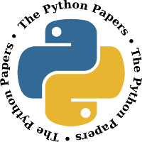
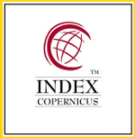

La conferencia ofrece a los investigadores la posibilidad de publicar artículos académicos en la revista internacional __The Python Papers__ (TPP), ISSN: 1834-3147, y posters y abstracts en "The Python Papers Monograph (TPPM)" . Ambs publicaciones están indexadas en:

|                                        |                                        |
|:--------------------------------------:|----------------------------------------|
|  | **Google Scholar** : Google search engine for academic papers |
|      | **Directory of Research Journals Indexing** : **3674** Indexed Journals, **96378** Total Articles, **190** Total Countries |
|  | **Index Copernicus** : The [ICI Journals Master List](http://journals.indexcopernicus.com/page.php?page=2) database contains over 22 000 journals. Index Copernicus Value (ICV) is the measure of a journal's strength. It provides information on how fast a published article is able to increase the citation rate. ICV is a respected measure used to rate scientific journals. |
|      | **Directory of Open Access Journals** : **9,457** Journals, **128** Countries, **2,442,144** Articles. |
|  | **OAIster (R)** : OAIster includes more than 50 million records that represent digital resources from more than 2,000 contributors. |
|  | **OCLC FirstSearch (R)** : OCLC FirstSearch service is a valuable access point to research databases. |
|  | **Pandora, Australia's web archive** : PANDORA (Preserving and Accessing Networked Documentary Resources of Australia), online repository for Australian publications. |
|  | **National Library of Australia**:       |
|  | **Ovid LinkSolver** : A journal and book browsing and linking tool. |
|  | **Ulrich's Global Serial Directory** :   |
|  | **EBSCOhost Research Databases** :  EBSCOhost databases are the most-used, premium online information resources for tensof thousands of institutions worldwide, representing millions of end users.Now you can access five new Ultimate Databases from EBSCO with superior content,global coverage, and relevant results. |
|  | **OCLC Worldcat** :                      |
|  | **Electronic Journal Library @ University Library of Regensburg** : The Electronic Journals Library is a service that enable the access to serialized journals spread over Internet. In 2016 more than 600 institutions collaborate actively with the project. |
|  | **eGranary Digital Library** : eGranary Digital Library - also known as _Internet inside a box_ - offers millions of educational resources to institutions with low band Internet access. |

### Instrucciones para publicar en The Python Papers (TPP)

1. [Registrarse como autor en TPP](http://ojs.pythonpapers.org/index.php/tpp/user/register).
2. [Enviar un artículo antes del 1 de Mayo](http://ojs.pythonpapers.org/index.php/tpp/author/submit).

    2.1. Seleccione la opción "Peer-reviewed Articles", y siga las instrucciones.

    2.2. **Importante:** agregar **SciPyLA2017** en el campo "Comments for the Editor".

3. Arbitros expertos en su temática harán la revisión.
4. Se le notificará la decisión editorial antes del 1ro de Junio: [(ver fechas)](#deadlines).

    4.1 RECHAZADO: Ud. solo podrá leer los commentarios hechos por los expertos.

    4.2 ACEPTADO: Ud. deberá enviar antes de la fecha indicada cualquier corrección que le sea solicitada. [(ver fechas)](#deadlines).

#### Instrucciones para envío de Posters a la Monografía TPPM

Usted solamente necesitará enviar un resúmen de la presentación de su poster.

1. [Registrarse como autor en TPPM](http://ojs.pythonpapers.org/index.php/tppm/user/register).

   Seleccionar el registro como "as author".

2. [Enviar el resumen antes del 1 de Mayo](http://ojs.pythonpapers.org/index.php/tppm/author/submit).

    2.1. Seleccione la opción "Peer-reviewed Articles", y siga las instrucciones.

    2.2. **Importante:** agregar **ScipyLA2017** en el campo "Comments for the Editor".

3. Arbitros expertos en su temática harán la revisión.

4. Se le notificará la decisión editorial antes del 1ro de Junio: [(ver fechas)](#deadlines).

    4.1 RECHAZADO: Ud. podrá leer los commentarios hechos por los expertos.

    4.2 ACEPTADO: Ud. deberá enviar antes de la fecha indicada cualquier corrección que le sea solicitada antes del 15 de Julio. [(ver fechas)](#deadlines).

5. Envíe el poster completo a los __Contactos del Event__ antes del 15 de Julio: [(ver fechas)](#deadlines).

#### Formato para redacción de los artículos.

Por favor, antes de seguir los pasos para enviar su artículo, asegúrese de haber utilizado una de las siguientes plantillas para redactar su contenido.

* [Plantilla ODT para redactar su artículo](http://ojs.pythonpapers.org/templates/TPP_TPPSC_template.odt)
* [Plantilla DOC para redactar su artículo](http://ojs.pythonpapers.org/templates/TPP_TPPSC_template.doc)

Los artículos completos no excederán las 10 páginas.

Los posters tendrán una dimensión de 70cmx100cm, con márgenes por sus cuatro lados de 1.5cm. Use las mismas fuentes ofrecidas en las plantillas de los artículos adicionando de manera obligatoria título, autores, contactos, resumen y resultados, y luego otros de su elección.

Para más información le invitamos a consular las [instrucciones de publicación en The Python Papers](http://www.pythonpapers.org/instAuthor.html)

#### Fechas Importantes {#deadlines}

*   Sitio Web de la Conferencia: Agosto 2016
*   Aceptación de revisores: 25 abril 2017
*   Recepción de trabajos: 1 de mayo 2017
*   Respuesta de revisores: 1 de junio 2017
*   Envío de correcciones: 15 de julio 2017

******************************************************************

## Actividades previstas {#activities}

* **Tutoriales** : Talleres ofrecidos por expertos dirigidos a mejorar la productividad de los investigadores.

* **Presentaciones y charlas:** Conferencistas invitados hablarán acerca de tendencias mundiales y mejores prácticas en el ámbito científico.

* **Sesiones de Posters:** Exponga sus investigaciones utilizando pancartas y medios visuales atractivos.

* **Sprints:** Reúnase con los autores de bibliotecas singulares para conocer maneras más eficientes de realizar cálculos científicos.

* **Charlas relámpago:** Promocione y amplíe el alcance de su investigación exponiendo en breve tiempo sus ideas a los especialistas de la región.

# Inscripción / Asistencia / Pagos

Las [cuotas de inscripción](../../register) cubren solamente la posibilidad de asistir al evento y están diferenciadas por regiones para promover la participación de estudiantes, profesionales e investigadores de América Latina y el Caribe imposibilitados de estar presencialmente en el evento por circunstancias de índole económica u otras razones. Para más detalles sobre el tema consulte las [cuotas de inscripción](../../register). Para conocer otras maneras de financiar su participación infórmese sobre [las ayudas financieras](../../forms/financial-aid/es).

TODO: Travel guidelines

******************************************************************

# Contactos {#Contact}

Ayúdenos a organizar sus intereses en la agenda de la conferencia enviando su área específica de investigación a los contactos del evento. 

*   2017@scipyla.org
*   scipyla2017@pythoncuba.org
*   scipyla2017@cuban.tech

Si estuviera interesado en otros temas le invitamos a conocer la [lista de talleres del evento](../../tracks).

