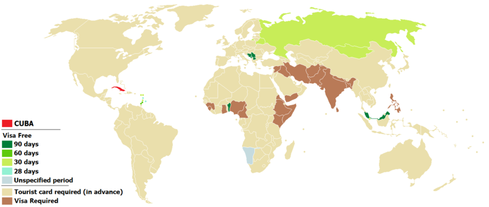
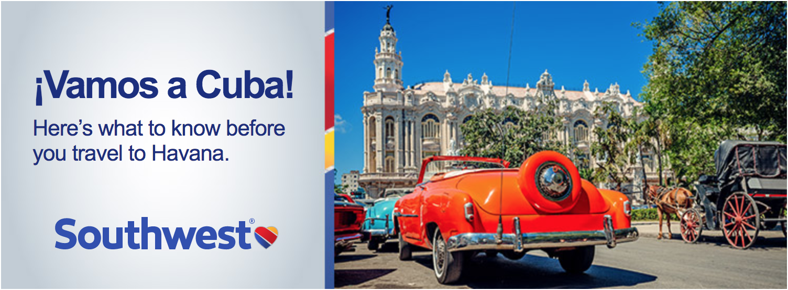

## Visa

Esta página tiene el objetivo de presentar información sobre los requerimientos
de trámites para
viajar a Cuba. Tratamos de lograr que nuestros consejos sean tan exhaustivos,
detallados y precisos como nos resulta posible. Sin embargo le rogamos su
comprensión de la complejidad de este tema considerando:

* la naturaleza de las solicitudes de VISA, en particular el hecho que
  cada país de orígen puede requerir información específica para realizar la
  solicitud de Visa e imponer procedimientos específicos que varían
  de acuerdo a la categoría de Visa y al país de destino
* la influencia de los vínculos contractuales con cierto contratista u empleador
* las diferentes regulaciones y tipos de situaciones migratorias y de ciudadanía
  admitidas por diferentes países
* las situaciones especiales de viajeros solicitando VISA para
  arribar a un país de destino estando en otro que no está relacionado con el de
  su ciudadanía
* los acuerdos bilaterales entre naciones para temas migratorios
* los aspectos específicos de la legislación vigente en lo que concierne a la
  organización de conferencias en Cuba.
* otros factores muy específicos que influencian la aprobación de solicitudes
  de Visa
* las diferencias de cobertura de seguro en los diferentes países
* las equivalencias monetarias de las coberturas a nivel internacional
* las regulaciones sobre condiciones de salud pre-existentes e implicaciones
  a futuro de tratamientos y procedimientos médicos
* los acuerdos bilaterales entre empresas aseguradoras

Por favor, confirme en su país la información antes de viajar.

******************************************************************

#### Trámites de VISA

Los trámites de solicitudes de VISA son gestionados por la
[Universidad de Sancti Spiritus](http://uniss.edu.cu). Las instrucciones
incluídas en esta página han sido comprobadas por el
personal de esta institución especializado en estos trámites para la realización
de eventos internacionales aprobados por el Ministerio de Educación Superior
de Cuba.

#### Trámites de Visa para ciudadanos de los Estados Unidos de América e Israel

Los **ciudadanos de los Estados Unidos de América** e **Israel**
son requeridos de solicitar una **VISA A-6**. Este tipo de Visa es de 
**caracter obligatorio** para los ciudadanos de estos países que viajen a
Cuba para participar en **cualquier evento** no gubernamental atendido o 
auspiciado por los organismos u organizaciones cubanas. Utilice el
[formulario de Solicitud de Visa General](http://bit.ly/visa-cuba-general)
Los participantes deben especificar como **motivos del viaje**
**Participación en conferencia SciPyLA 2017 y YayaboCiencia 2017**. El
**organismo cubano responsable de su viaje** sería la
**Universidad de Sancti Spiritus "José Martí"**. Si Usted ha propuesto una
actividad y esta ha sido aceptada, incluya el título de la misma en 
las **observaciones**, por ejemplo **Charla aceptada: Título de mi charla**.
En caso contrario solamente incluya en las **observaciones**
uno de los textos **Participante** o
**Invitado por los Organizadores**, según sea el caso.

#### Trámites de VISA para ciudadanos de otros países

Una referencia bien documentada y realmente práctica (aunque de ninguna
manera puede ser considereada oficial) es
[esta página sobre políticas de VISA de Cuba](http://bit.ly/wikipedia-en-visa-cuba).
Consúltela para determinar:

* si los ciudadanos de su país no necesitan solicitar VISA para viajar a Cuba
* o si pueden viajar a Cuba con una tarjeta de turista
* si solicitar VISA es un trámite obligatorio para los ciudadanos de su país
* si está prohibida la entrada a Cuba para los ciudadanos de su país

El siguiente mapa le puede dar una rápida idea de cual es su situación , pero no deje de consultar la página antes referida.

#### Casos de exención de Visa

No necesitan solicitar Visa, las personas en posesión de una Visa válida
durante la duración del evento, siempre que sean de uno de los siguientes tipos

* **C-1** : Se expide a los extranjeros invitados por visitas protocolares de alto nivel.
* **C-2** : Se expide a las personalidades extranjeras invitadas por las organizaciones políticas, sociales y de masas.
* **D-1** *(Técnicos y científicos)* : Se expide a los extranjeros técnicos, científicos o que por su especial calificación, sean contratados por los organismos oficiales cubanos para trabajar en Cuba, por el tiempo que se indique en el contrato y aquellos que en virtud de convenios de colaboración requieran entrar al país.
* **D-2** *(Estudiantes y becarios)* : Se expide a los estudiantes y becarios extranjeros admitidos en Cuba por un centro de estudio, investigaciones o adiestramiento, seleccionados conforme a los programas de intercambios, cooperación y colaboración educacional de Cuba.
* **D-3** *(Artistas)* : Se expide a extranjeros que arriben al territorio nacional para ejercer su arte.
* **D-4** *(Deportistas)* : Los deportistas o auxiliares de equipos de deporte e integrantes de delegaciones deportivas en general, extranjeros que arriben a Cuba con ese carácter.
* **D-5** *(Asilados políticos y refugiados)*
* **D-7** *(Representantes comerciales o agentes de negocios)* : Se otorga a los extranjeros que viajen a Cuba para dedicarse a actividades comerciales o de negocios con el consentimiento expreso de los organismos autorizados en Cuba para ello.
* **E-1** : Se expide a los extranjeros que soliciten residir permanentemente en Cuba con ciudadanos cubanos que sean sus padres o hijos, acreditando debidamente el parentesco, asi como el cónyuge, siempre que el matrimonio se haya efectuado de acuerdo a las leyes cubanas.
* **E-2** : Se otorga a extranjeros que no se encuentren dentro de la definición anterior, siempre que obtengan la visa y la autorización expresa de la Dirección de Inmigración y Extranjería.

Las personas que hayan ingresado al territorio nacional de Cuba con una Visa de
tipo *D-6* (periodistas), *D-8* (motivos religiosos), *D-10* (tratamiento médico),
*B-1*, *B-2*, *B-3*, *B-4*, *B-5*, *B-6* (Visa diplomática) o alguna otra
categoría, deben [contactar a los organizadores](../../#contact-div) con
antelación de estar interesados en asistir a la conferencia.

#### Tarjetas de turismo

La Visa de turismo (i.e. **visa A-1**) o tarjeta turística
es válida para una sola entrada al territorio nacional de Cuba en un viaje
de 30 días (90 días para los ciudadanos de Canadá) y se puede prorrogar
por un período igual al que fue expedida contactando el buró del
hotel donde se hospeda el viajero o acudiendo en persona ante las autoridades de
inmigración y extranjería.

##### Viajes directos desde Estados Unidos de América

Las ciudadanos de cualquier país del mundo que realicen un viaje directo desde
los Estados Unidos de América a Cuba deben adquirir las tarjetas de turismo
que ofrecen las compañías norteaméricanas. Estas tarjetas son diferentes a las
expedidas para visitantes provenientes de otras regiones del mundo.
Es una buena práctica adquirir la tarjeta de turismo en la agencia de viajes
o aerolínea junto con su pasaje de avión o crucero. En particular hemos
confirmado el procedimiento previamente con
[Southwest](https://www.southwest.com) . Esta aerolínea permite
[reservar tickets](https://www.southwest.com/flight/search-flight.html)
de ida e ida y vuelta para las rutas
*Fort Lauderdale, FL (FLL) -> Havana (HAV)* y
*Tampa, FL (TPA) -> Havana (HAV)* . Por favor lea las instrucciones
ofrecidas por Southwest a los visitantes extranjeros. 

Al comprar la tarjeta de turista y abordar al avión el viajero le será presentado
un formulario. Entre la información a proporcionar se encuentra el motivo del
viaje (también conocida como licencia o categoría de viaje). Los participantes
a la conferencia SciPyLA 2017 viajan bajo la categoría 
**Professional research or meetings** de la
[licencia de excepción general de OFAC](https://www.treasury.gov/resource-center/sanctions/Programs/Documents/cuba_faqs_new.pdf).

##### Tarjetas de turismo en Canadá, Reino Unido, Europa, Australia y Nueva Zelanda

Algunas compañías como [CubaVisas.com](http://www.cubavisas.com/visa.php?act=tcform&flight=yes&accom=no) venden tarjetas de turismo para que ciudadanos de Canadá, Reino Unido, Europa, Australia y Nueva Zelanda viajen a Cuba. Las tarjetas se pueden comprar en línea. Existen opciones de envío a varias regiones del planeta.

##### Tarjetas de turismo en otros países

La tarjeta de turismo puede ser adquirida en las sedes de las 
[misiones diplomáticas de Cuba](http://bit.ly/visa-cuba-misiones). Para obtenerla
de esta manera debe presentar:

* Pasaporte válido
* [Formulario](http://bit.ly/visa-cuba-tour)
* Billete de Avión con fecha de entrada y regreso
* Debe abonar el arancel consular estipulado para este servicio

Al solicitarla y pagar la entrega debe ser inmediata (el mismo día de la
solicitud).

Los documentos necesarios para su obtención vía correo postal

* Fotocopia legible del pasaporte válido
* Fotocopia legible del billete de Avión con fecha de entrada y regreso
* Debe abonar el arancel consular estipulado para este servicio
* Sobre con suficientes sellos y dirección para el retorno del visado

Por vía postal se le cobrará un arancel adicional por el servicio.

Todo pago debe realizarse en efectivo o por medio de pago certificado de banco.
El efectivo enviado por correo será rechazado y devuelto a riesgo del
solicitante.

Las condiciones de adquisición y los proveedores de tarjetas de turismo pueden
cambiar de un país de orígen a otro. Si Usted tiene conocimiento de las gestiones
necesarias para hacer este trámite en su país, por favor
[cree un fork](https://help.github.com/articles/fork-a-repo/) del
[repositorio git de este sitio web](http://github.com/scipy-latinamerica/scipyla2017-web), 
[edite este documento en su fork en Github](https://help.github.com/articles/editing-files-in-your-repository/) y
[envíenos un pull request](https://help.github.com/articles/creating-a-pull-request/).
Si este procedimiento le resulta complicado o muy técnico, simplemente
[envíe la información](../../#contact-div)
a la dirección de email de la conferencia `2017@scipyla.org`.
Nosotros trataremos de incluir sus contribuciones con la mayor brevedad
que nos sea posible ya que la actualización de esta guía le facilitará el
trámite a otros participantes .

#### Solicitud de Visa de turismo

Utilice el
[formulario de Solicitud de Visa de Turismo](http://bit.ly/visa-cuba-tour)
para llenar los datos de solicitud de Visa de turismo para viajar a Cuba.
Su solicitud de VISA debe ser enviada posteriormente a una de las sedes de las 
[misiones diplómaticas cubanas](http://bit.ly/visa-cuba-misiones) con oficinas de trámites consulares.

#### Carta de invitación al evento.

Si necesita una carta de los organizadores para adjuntarla a su solicitud
de Visa, por favor [contáctenos](../../#contact-div) enviando un mensaje
via e-mail a la dirección `2017@scipyla.org`.
Le recomendamos que solicite la carta de invitación al evento para aclarar
de forma expedita cualquier duda que pueda haber sobre las razones de su viaje.

#### Documentación requerida para el viaje

Antes de viajar le recomendamos consultar la [guía de Southwest para viajeros internacionales](http://bit.ly/travel-doc). No podemos garantizar que esta
información esté actualizada. Por favor confirme los detalles en el país de
orígen antes de su viaje.

#### Información a considerar

Información importante que el portador debe considerar:

- Conservar la Tarjeta de Turista hasta su salida. En ella se asienta la entrada y salida de Cuba. En caso de pérdida, deberá comunicarlo de inmediato a Inmigración para obtener un duplicado, previo pago del arancel correspondiente.
- Para su salida (de Cuba) es requisito imprescindible presentar la tarjeta junto a su pasaporte y boleto de viaje.
- La Tarjeta de Turista no es válido sin el cuño de la entidad que la emitió. En la parte posterior de la misma debe tener estampado el cuño de la línea aérea, agencia de viaje o consulado que se la expidió.

#### Prórroga de estancia en Cuba con Visa-Tarjeta de Turista.

Si Usted ya tiene una Visa válida pero necesita una prórroga para asistir al evento, deberá tramitar una extensión del visado.

Para solicitar una prórroga debe presentarse (mínimo una semana antes del vencimiento de la visa) en las Oficinas de la Dirección de Inmigración y Extranjería del municipio donde va a residir o en su defecto en la DIE Nacional. La información de contacto de la DIE Nacional es la siguiente.

>  **Dirección Nacional de Inmigración y Extranjería**
>
>
>  *Dirección*: Ave. 3ra y 22, Playa, Ciudad de La Habana.
>
>  *Teléfono*: (53-7) 206-3218 / 858-5100.

Para el trámite debe presentar:

* Pasaporte.
* Visa-Tarjeta de Turista.
* Recibo de pago del hospedaje en casa particular (autorizadas al arrendamiento según el Decreto-Ley 171/97); o fotocopia del contrato de arrendamiento de la casa particular donde se encuentra alojado; o tarjeta de huésped si se aloja en un hotel.
* Boleto de avión con nueva fecha.
* Sellos timbrados correspondiente al costo por la prórroga,
  que consiste en 25 CUC a pagar con sellos timbrados.
  Podrá comprar los sellos timbrados en las sucursales del Banco Metropolitano,
  u otro que opere en moneda libremente convertible (CUC).

## Seguros

En muchos casos la compra de su pasaje de avión incluye otros beneficios,
tales como el seguro médico. Infórmese sobre este particular antes de realizar
su viaje. De no incluir seguro de ningún tipo, o en caso que se desee extender
la cobertura de servicios, por favor consulte el
[sitio web de ESICuba](http://www.esicuba.cu/index.php/nuestros-seguros/personas).
Le aconsejamos que preste atención a
[la solicitud de seguro individual para gastos médicos](http://www.esicuba.cu/images/documentos/solicitudes/ESI%2098017_03-Individuales%20y-o%20Familiares%20%2801092014%29.pdf)
y las [condiciones generales de este servicio](http://www.esicuba.cu/images/documentos/solicitudes/ESI%2098017_05%20%2801042016%29.pdf);
así como
[la solicitud de seguro de asistencia al viajero](http://www.esicuba.cu/images/documentos/solicitudes/ESI%2004051_03%20%2801012013%29.pdf)
y sus [condiciones generales](http://www.esicuba.cu/images/documentos/ESI%2004051_05%20CG02%20(01092016).pdf).

Para más detalles consulte la [ley cubana sobre póliza de seguro para viajar a Cuba](http://bit.ly/visa-cuba-ley-seguro).

#### Adquisición del seguro

Si no posee una póliza de gastos médicos para viajar a Cuba la puede adquirir en

* En el punto de origen: Agencias de viaje en el país donde reside o desde el cual viajará hacia Cuba.
* Al arribo a Cuba: Los viajeros que excepcionalmente no porten el seguro en el momento del arribo, podrán adquirir una póliza con cobertura de seguro y asistencia suscrita por aseguradoras cubanas, en el propio aeropuerto, puerto o marina.

La primera opción es recomendada , especialmente si en su país el seguro
fuera un requisito para solicitar su Visa.

#### Cobertura de seguro

Destinados a personas que viajan desde o hacia Cuba, incluyendo aquellas que de forma temporal o a más largo plazo permanecen en el país.

Estos seguros satisfacen las regulaciones actuales del país sobre la entrada de viajeros y la estancia de extranjeros en el territorio nacional y cumplimentan los requerimientos de visado de los diferentes países incluyendo la Unión Europea.

Los productos que se ofrecen son combinaciones de coberturas de gastos médicos y repatriación con la inclusión de otras convenientes para resolver situaciones en las que los viajeros se pueden encontrar inmersos.

##### Seguro de Viajes

* Gastos Médicos por Enfermedad y Accidente
* Repatriaciones
* Anticipo de Fondos
* Seguro de Accidente
* Equipaje
* Gestión de documentos
* Otros gastos
 
##### Seguro de Gastos Médicos

*  Hospitalización y Cuidados Intensivos
*  Gastos médicos quirúrgicos y no quirúrgicos
*  Gastos clínicos y especiales
*  Cirugía y tratamiento ambulatoria
*  Traslados sanitarios
*  Maternidad y Gastos del recién nacido
*  Urgencia médica de enfermedad preexistente y/o congénita
*  Odontología de Urgencia
*  Oftalmología
*  Medicamentos
*  Repatriación

#### Homologación de poliza de seguro en el país de orígen.

El siguiente listado muestra las compañías aseguradoras reconocidas en Cuba.
En cualquier caso, por favor, contacte a su compañía aseguradora y verifique
los términos.

##### España

* B.I. ASSISTANCE
* CAP ARAG
* CORIS
* FUNESPAÑA
* IBERO ASSISTANCE
* RACC
* RACE ASISTENCIA
* SOS ASSISTANCE MADRID
* MAFRE
* WINTERTHUR

##### Bélgica

* ELVIA-BRUSELAS
* EUROP ASSISTANCE
* EUROCROSS
* INTER ASSISTANCE
* MONDIAL ASSISTANCE

##### Brasil

* ASSIST-CARD
* CORIS
* EUROCENTER
* MONDIAL BRASIL
* WORLDWIDE ASSISTANCE EUROP ASSISTANCE

##### Canadá

* ACM
* ASSURED ASSISTANCE
* CANASSISTANCE
* DESJARDINS (SIGMA-ASSISTEL)
* FOX FLIGHT
* GLOBAL EXCEL
* HEALTH INSURANCE DIVISION
* ICMS-WORLDWIDE EMERGENCY ASSIST (TORONTO)
* JOHN INGLE INSURANCE
* KEEWATIN AIR
* MAGNUS POIRIER
* MEDICAL SERVICES ASSOCIATION
* MONDIAL ASSISTANCE
* POLTRUTT & SMITH
* SIGMA ASISTEL
* SKY SERVICE-FBO INC
* WORLD ACCESS, CANADA
* WORLD TRAVEL PROTECTION
* WORLDWIDE MEDICLAIM

##### Chile

* ASSIST-CARD
* MONDIAL ASSISTANCE
* SUR ASISTENCIA (MAPFRE)

##### Colombia

* ANDIASISTENCIA
* ASSIST-CARD
* CORIS COLOMBIA
* PANAMERICAN ASSISTANCE
* COSTA RICA
* ASSIST-CARD

##### República Checa

* ELVIA

##### Dinamarca

* EURO ALARM
* INTERNATIONAL HEALTH INSURANCE
* NORDIC INTERNATIONAL ASSISTANCE
* SOS INTERNATIONAL

##### Inglaterra

* ACIA-SEA CLAIMS = ANGLO CARIBBEAN INSURANCE
* AEA INTERNATIONAL – SOS ASSISTANCE
* ALPHA ASSISTANCE
* ASSISTANCE 2000 – PRIMARY ASSISTANCE
* ASSISTANCE INTERNATIONAL
* CEGA
* CIGNA
* COOPERATIVE FUNERAL SERVICE
* EUROP ASSISTANCE
* FIRST ASSIST
* GREEN FLAG
* HACIA
* IAS = INTERNATIONAL ASSISTANCE SERVICE FIRST SERVICE
* INTERGROUP ASSISTANCE SERVICE
* INTERNATIONAL MEDICAL RESCUE
* KENYON AIR TRANSPORTATION
* MEDEX ASSISTANCE
* MERCURY INTERNATIONAL ASSIST
* MONDIAL ASSISTANCE
* ROWLAND BROTHERS INTERNATIONAL
* SFA
* SOS INTERNATIONAL
* THOMAS COOK
* TRAVEL PROTECTION
* WORLDWIDE ASSISTANCE

##### Finlandia

* EMA EMERGENCY MEDICAL ASSISTANCE
* EUROOPPALAINEN INSURANCE

##### Francia

* CGS
* FIDELIA
* FRANCE ASSIST
* FRANCE SECOURS INTERNATIONAL
* GESA PARIS
* INTERFUNE
* INTERMUTUELLE ASSISTANCE
* MEDIC AIR INTERNATIONAK
* POMPES FUNEBRES GENERALES

##### Grecia

* EUROP ASSISTANCE
* MAFRE

##### Holanda

* ANWB
* ELVIA ASSISTANCE
* EUROCROSS
* OHRA
* SAS ALARM SERVICE
* SOS INTERNACIONAL

##### Hungría

* EUROP ASSISTANCE

##### Italia

* ACI GLOBAL – SPA
* AIDE ASSISTANCE
* CORIS
* ELVIA ASSISTANCE (MADRID)
* EURA MILAN
* EUROP ASSISTANCE
* FILO DIRETTO
* ITAL ASSISTANCE (AIDE)
* MONDIAL ASSISTANCE
* SFA
* WAY CALL

##### Japón

* EUROP ASSISTANCE
* SFA

##### Mexico

* ASSIST-CARD
* AXA – GESA ASSISTANCE
* EUROP ASSISTANCE
* GLOBAL LIFE FLIGHT
* MAS MEXICO - MMC MEXICO
* MÉXICO ASSISTANCE
* PANAMERICAN ASSISTANCE

##### Panamá

* PANAMA ASISTENCIA – MAFRE

##### Perú

* ASSIST-CARD

##### Polonia

* CORIS VARSOVIA
* ELVIA
* ELVIA POLONIA
* EUROP ASSISTANCE

##### Portugal

* AIDE ASISTENCIA
* COMPAÑÍA PORTUGUESA DE SEGUROS DE ASISTENCIA
* ELVIA PORTUGAL
* EUROP ASSISTANCE

##### Puerto Rico

* AERO AMBULANCE

##### Rusia

* ACCORD LIMITED
* BAO INTOURIST
* GLOBAL VOYAGEUR ASSISTANCE
* INTERMAR LIMITED
* SOS INTERNATIONAL

##### Singapur

* WORLDWIDE ASSISTANCE

##### Sudáfrica

* EUROP ASSISTANCE

##### Suecia

* SFA

##### Suiza

* ELVIA SUIZA
* EUROP ASSISTANCE
* MEDICALL
* ZURCÍ VERSICHERUNGSGESELLSCHAFT

##### Estados Unidos

* AIR AMBULANCE PROFESSIONALS
* EUROP ASSISTANCE INTERNATIONAL (LOS ANGELES)
* MEDEX
* MERCURY INTERNATIONAL ASSISTANCE
* MONDIAL ASSISTANCE
* MONEY GRAM
* NATIONAL JETS
* NATIONAL AIR AMBULANCE
* ON-CALL INTERNATIONAL (IAG)
* USA ASSIST-DEMOCRACY CENTER
* WORLD NET
* WORLDWIDE ASSISTANCE SERVICES (WASHINGTON)

