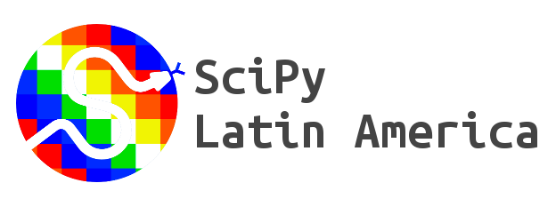

.. SciPy Latin America documentation master file, created by
   sphinx-quickstart on Wed Aug 28 21:56:12 2013.
   You can adapt this file completely to your liking, but it should at least
   contain the root `toctree` directive.

Inicio
======

Nucleamos a los usuarios de **Python** en el ámbito científico, para
centralizar la comunicación a nivel regional.

Pretendemos llegar a usuarios, académicos y empresas, promover el uso de Python,
intercambiar información, compartir experiencias y en general, ser el marco de
referencia local en el uso y difusión de esta tecnología en la ciencia.

Nuestros objetivos son simples:

#. Fomentar la ciencia.
#. Fomentar la adopción de la informática como herramienta de estudio científico.
#. Fomentar el uso de Python como principal herramienta informática en la ciencia.

¿Por qué participar?
^^^^^^^^^^^^^^^^^^^^

Para conocer las herramientas y bibliotecas de uso científico desarrolladas
por la comunidad mundial, intercambiar experiencias y conocer las ventajas del
lenguaje Python en la comunidad científica argentina, concretar encuentros,
foros de discusión y proyectos educativos y de investigación y desarrollo
científico relacionados con **Python**.

¿Por dónde empezar?
^^^^^^^^^^^^^^^^^^^

Depende...

- **Si no sabes Python (y quieres aprender):**
  Esta página de Python.org |PYTHON_DOCS| tiene una recopilación de links y
  material útil para aquellos que se inician en este lenguaje.

- **Si sabes Python y quieres dedicarte a la ciencia con el lenguaje:** Podés unirte
  a nuestra foro (|SCIPYLA_FORUM|), dirigirte a la página de
  SciPy.org (|SCIPY|)

.. toctree::
    :hidden:
    :maxdepth: 1

    scipycon.rst

